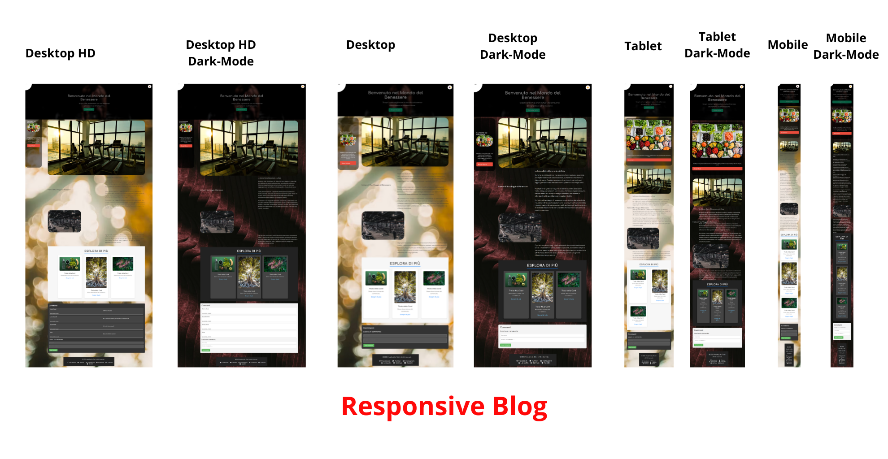
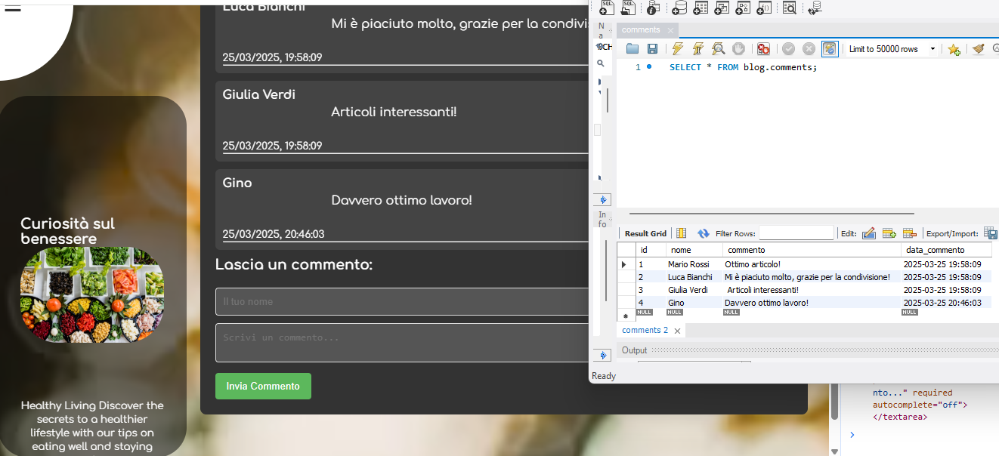

# 🧘‍♀️ Health & Fitness Blog

Welcome to the **Health & Fitness Blog** project, a platform dedicated to physical and mental well-being! This site is designed to offer content on training, nutrition, and health, with a dynamic comment system and a dark mode feature.



## 🚀 Key Features

- **Responsive Design**: Adapts to all devices (desktop, tablet, mobile).
- **Comment System**: Users can leave comments that are stored in a MySQL database.
- **Dark Mode**: Activate dark mode for better reading in low-light environments.
- **Welcome GIF**: A dynamic GIF is used as a welcome banner to make the site more interactive.

## 📸 Project Demo

### Welcome to the world of well-being! 🌱


### 📂 Technologies Used

- **Frontend**: HTML5, CSS3, JavaScript
- **Backend**: Node.js, Express
- **Database**: MySQL
- **Other tools**: FontAwesome (for icons), Git for version control

⚙️ Server & Database Architecture
The backend is built with Node.js and Express, and it uses MySQL to store user comments. Below is an overview of how the system works:

### 🔄 Data Flow
The user submits a comment through the frontend form.

The frontend sends a POST request to an Express API endpoint.

The server validates the data and saves it in the comments table in MySQL.

On page load, the server fetches existing comments via a SELECT query and sends them to the frontend for display.

### 📁 Server Structure

server.js: Main entry point for the Express server.

routes/comments.js: Handles routes related to user comments.

db.js: Manages the MySQL database connection (using mysql2 or mysql npm package).


## 🛠️ How to Set Up the Project

### 1. Clone the repository

```bash
git clone https://github.com/your-username/your-repo.git
2. Install the dependencies
Navigate to the project folder and install the dependencies:

cd your-repo
npm install
3. Set up the database
Create a MySQL database called blog_comments and a table to store the comments:


CREATE TABLE comments (
    id INT AUTO_INCREMENT PRIMARY KEY,
    name VARCHAR(255) NOT NULL,
    comment TEXT NOT NULL,
    created_at TIMESTAMP DEFAULT CURRENT_TIMESTAMP
);
4. Start the server
Run the server with the following command:


npm start
Access the site at http://localhost:3000.

💡 Additional Features
Dark Mode 🌙
You can activate dark mode by clicking on the moon 🌙 icon in the navigation menu. Dark mode improves readability in low-light environments.

Comment Section 📝
Users can leave comments in the dedicated section. Each comment is saved to the database and displayed dynamically.

Here’s an example of what it might look like:


New Cards 🔥
Add "cards" to display other related articles or content. Each card can include an image, a title, and a brief description.


MIT License

Copyright (c) [anno] [tuo nome]

Permission is hereby granted, free of charge, to any person obtaining a copy
of this software and associated documentation files (the "Software"), to deal
in the Software without restriction, including without limitation the rights
to use, copy, modify, merge, publish, distribute, sublicense, and/or sell
copies of the Software, and to permit persons to whom the Software is
furnished to do so, subject to the following conditions:

The above copyright notice and this permission notice shall be included in all
copies or substantial portions of the Software.

THE SOFTWARE IS PROVIDED "AS IS", WITHOUT WARRANTY OF ANY KIND, EXPRESS OR
IMPLIED, INCLUDING BUT NOT LIMITED TO THE WARRANTIES OF MERCHANTABILITY,
FITNESS FOR A PARTICULAR PURPOSE AND NONINFRINGEMENT. IN NO EVENT SHALL THE
AUTHORS OR COPYRIGHT HOLDERS BE LIABLE FOR ANY CLAIM, DAMAGES OR OTHER
LIABILITY, WHETHER IN AN ACTION OF CONTRACT, TORT OR OTHERWISE, ARISING FROM,
OUT OF OR IN CONNECTION WITH THE SOFTWARE OR THE USE OR OTHER DEALINGS IN
THE SOFTWARE.

